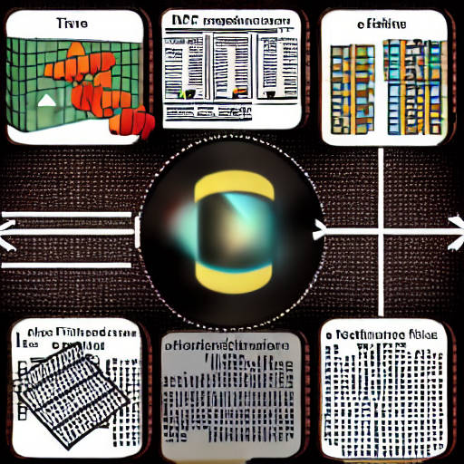

# Document Retrieval Algorithm

This project implements a document retrieval algorithm using TF/IDF (Term Frequency-Inverse Document Frequency) to index documents and retrieve relevant matches based on user queries. It incorporates natural language processing techniques to enhance the accuracy of search results. The goal of this algorithm is to provide an efficient and effective solution for document retrieval.

## Features

- **TF/IDF Indexing**: The algorithm indexes documents by calculating the TF/IDF values for each term in the document collection. This process assigns higher weights to terms that are more frequent in a document but less frequent in the overall collection.

- **Query Matching**: When a user submits a query, the algorithm compares the query terms with the indexed terms. It calculates relevance scores based on the TF/IDF weights and matches the query with the most relevant documents.

- **Natural Language Processing**: The algorithm leverages natural language processing techniques to improve the search results. It applies techniques like stemming, stop word removal, or part-of-speech tagging to preprocess the documents and queries, enhancing the accuracy of the retrieval process.

## Contributing

Contributions are welcome! If you find any issues or have suggestions for improvements, please feel free to submit a pull request.

## License

This project is licensed under the [MIT License](LICENSE).
